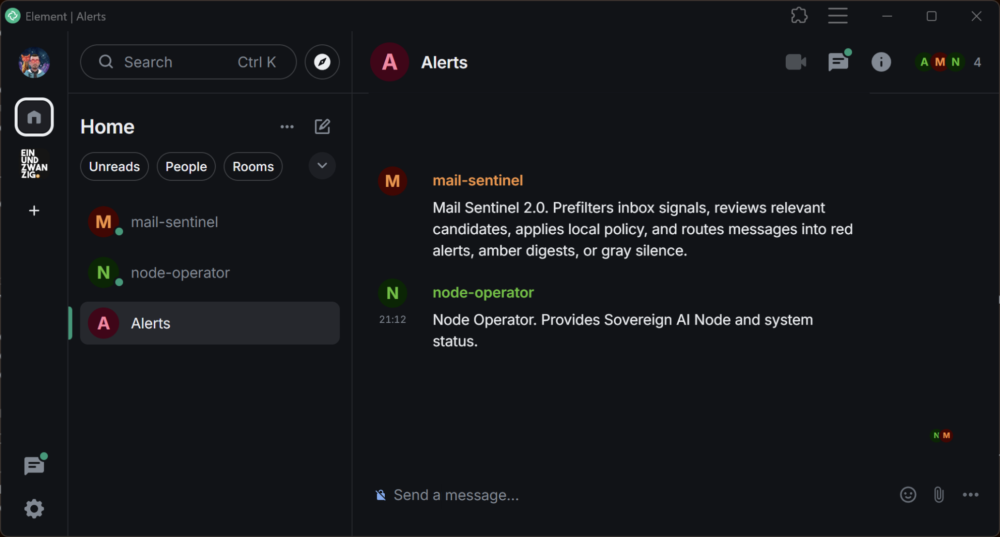

# Sovereign AI Node

Open-core, local-first multi-bot AI runtime with Matrix as the control plane.

Sovereign AI Node is a self-hosted platform for running specialized bots on your own infrastructure. Matrix is the operator-facing control plane. It is not a single bot, not a SaaS wrapper, and not a cloud dashboard.

## Prerequisites

The current documented path requires:

* a dedicated Ubuntu host — VM, bare metal, or VPS (22.04+ recommended)
* an [OpenRouter](https://openrouter.ai/) API key for the provider-backed bot runtime path
* an Element or other Matrix client for operator interaction

The installer provisions the Matrix stack (Synapse) and bot runtime (OpenClaw) automatically. Bot-specific prerequisites (e.g. IMAP mailbox credentials for Mail Sentinel) are documented in [`sovereign-ai-bots`](https://github.com/ndee/sovereign-ai-bots).

## Install

Run the guided installer on a fresh Ubuntu host (VM, bare metal, or VPS):

```bash
curl -fsSL https://raw.githubusercontent.com/ndee/sovereign-ai-node/main/scripts/install.sh | sudo bash
```

If you are working from a local checkout instead:

```bash
sudo bash scripts/install.sh --source-dir "$(pwd)"
```

## Architecture

Sovereign AI Node is the runtime and control plane layer. Bot packages are defined and versioned separately in [`sovereign-ai-bots`](https://github.com/ndee/sovereign-ai-bots).

| Layer | Repository | Role |
|---|---|---|
| **Runtime** | `sovereign-ai-node` | Installer, Matrix stack, agent/tool contracts, policy boundaries |
| **Bots** | `sovereign-ai-bots` | Installable bot packages, workspace files, manifests |

Matrix is the primary control plane. Bots register as Matrix users, operate inside rooms, and receive operator interaction through standard Matrix clients.

## Control plane


Matrix acts as the control plane for Sovereign AI Node and its bots.

## What it is

Sovereign AI Node is:

* local-first
* multi-bot by design
* Matrix-controlled
* open core
* cloud-optional
* privacy-first

## Current status

**Current focus:** Mail Sentinel on a single self-hosted Linux node.

Today, the project is centered on:

* Sovereign AI Node runtime
* OpenClaw as the default runtime backend
* a bundled Matrix stack
* external Element clients
* Mail Sentinel as the first concrete module

The broader multi-bot system is the platform direction. Mail Sentinel is the first real wedge. See the [Mail Sentinel package](https://github.com/ndee/sovereign-ai-bots) in `sovereign-ai-bots` for bot-level details and screenshots.

## Why Matrix

Matrix is the control plane because it gives the system:

* rooms as natural operator surfaces
* bot-native interaction
* local or self-hosted deployment options
* a clean path to multi-bot coordination

## Core model

Sovereign AI Node separates **templates** from **runtime instances**:

* **Sovereign Agent Template** — defines workspace files, runtime expectations, and required tools
* **Sovereign Tool Template** — defines capability contracts and configuration requirements
* **Sovereign Tool Instance** — a concrete local binding with real config and credentials
* **Sovereign Agent** — a managed runtime bot with its own workspace and Matrix identity

## Current templates

### Agent templates

* `mail-sentinel@2.0.0`
* `node-operator@2.0.0`

### Tool templates

* `mail-sentinel-tool@1.0.0`
* `imap-readonly@1.0.0`
* `node-cli-ops@1.0.0`

## Runtime strategy

Sovereign AI Node is **OpenClaw-first, adapter-safe**.

OpenClaw is the default execution framework today, but it sits behind a stable runtime boundary so the platform does not become permanently coupled to one runtime.

## Planned direction

The long-term direction is a modular bot system spanning mail, documents, calendars, operations, security, and finance. These are platform directions, not currently shipped modules.

## Docs

* `docs/ARCHITECTURE.md`
* `docs/MAIL_SENTINEL_DESIGN.md`
* `deploy/`
