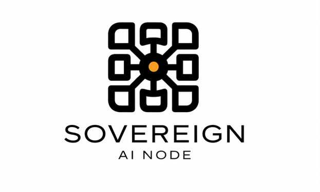

<p align="center">
  
</p>

# Sovereign AI Node

Open-core, local-first multi-bot AI runtime with Matrix as the control plane.

Sovereign AI Node is a self-hosted platform for running specialized bots on your own infrastructure. Matrix is the operator-facing control plane. It is not a single bot, not a SaaS wrapper, and not a cloud dashboard.

## Prerequisites

The current documented path requires:

* a dedicated Ubuntu or Debian host — VM, bare metal, or VPS (Ubuntu 22.04+ recommended)
* an [OpenRouter](https://openrouter.ai/) API key for the provider-backed bot runtime path
* an Element or other Matrix client for operator interaction

The installer provisions the Matrix stack (Synapse) and bot runtime (OpenClaw) automatically. Bot-specific prerequisites (e.g. IMAP mailbox credentials for Mail Sentinel) are documented in [`sovereign-ai-bots`](https://github.com/ndee/sovereign-ai-bots).

## Install

Run the guided installer on a fresh Ubuntu or Debian host (VM, bare metal, or VPS):

```bash
curl -fsSL https://github.com/ndee/sovereign-ai-node/releases/latest/download/install.sh | sudo bash
```

This pulls the bundled installer attached to the most recent tagged release. To pin a specific version, replace `latest` with the tag name (e.g. `v1.2.3`).

If you are working from a local checkout instead:

```bash
sudo bash scripts/install.sh --source-dir "$(pwd)"
```

The local-checkout flow uses the multi-file installer under `scripts/install/`. The `scripts/install.sh` you see in this repo is the orchestrator; it sources `scripts/install/lib-*.sh` at runtime. The single-file `install.sh` shipped via the release URL is built from the same sources by `scripts/install/build.sh` during the release workflow.

### Using the repo as a package

Downstream consumers can also install tagged versions straight from GitHub:

```bash
npm install github:ndee/sovereign-ai-node#v2.2.1
```

That install path now builds `dist/lib/` automatically when the published tree only contains sources. The supported import surfaces are the top-level package plus `sovereign-ai-node/installer`, `sovereign-ai-node/api`, `sovereign-ai-node/app`, `sovereign-ai-node/system`, and `sovereign-ai-node/contracts`. Wizard assets remain available under `sovereign-ai-node/public/setup-ui/*`.

## Update

Once installed, update to the latest release with:

```bash
sudo sovereign-node update
```

This downloads the bundled `install.sh` from the latest release and re-runs it in update mode. Pin a specific version with `--ref vX.Y.Z`.

## Setup UI and admin sign-in

Current installs also ship a local browser-based setup/admin surface at `/setup-ui/` on the node.

- First-run browser access uses a one-time bootstrap token.
- Issue or rotate that token with `sudo sovereign-node setup-ui issue-bootstrap-token`.
- After the first successful sign-in, later admin sign-in uses the operator's Matrix password.
- Matrix client onboarding still happens separately through `/onboard` and `sudo sovereign-node onboarding issue`.

### Recovery: hosts stuck on v2.0.0

`sovereign-node update` on v2.0.0 fetched the orchestrator script from `raw.githubusercontent.com` and silently exited 1 because the orchestrator requires a sibling `install/` library tree that was never downloaded. v2.1.0+ hosts use the bundled release asset and update normally.

To recover a v2.0.0 host, run the curl installer once manually — this matches what `sudo sovereign-node update` does on a fixed host:

```bash
curl -fsSL https://github.com/ndee/sovereign-ai-node/releases/latest/download/install.sh | sudo bash -s -- --update --non-interactive
```

After this completes, future updates can use `sudo sovereign-node update`.

## Using `sovereign-ai-node` as a package

`sovereign-ai-node` now ships build output and public subpath exports for Node-based integrations.

Install from npm or directly from GitHub:

```bash
npm install sovereign-ai-node
```

```bash
npm install github:ndee/sovereign-ai-node
```

GitHub installs run the package `prepare` step automatically, so `dist/` is built during install when it is not already present.

Current entrypoints:

* `sovereign-ai-node` — combined top-level exports
* `sovereign-ai-node/installer` — installer services and job runner types
* `sovereign-ai-node/api` — Fastify route registration helpers and auth/session utilities
* `sovereign-ai-node/app` — app container creation
* `sovereign-ai-node/system` — system helpers such as LAN IPv4 detection
* `sovereign-ai-node/contracts` — shared Zod-backed contracts and schemas
* `sovereign-ai-node/public/setup-ui/*` — bundled setup UI assets

## Architecture

Sovereign AI Node is the runtime and control plane layer. Bot packages are defined and versioned separately in [`sovereign-ai-bots`](https://github.com/ndee/sovereign-ai-bots).

| Layer | Repository | Role |
|---|---|---|
| **Runtime** | `sovereign-ai-node` | Installer, Matrix stack, agent/tool contracts, policy boundaries |
| **Bots** | `sovereign-ai-bots` | Installable bot packages, workspace files, Matrix avatar assets, manifests |

Matrix is the primary control plane. Bots register as Matrix users, operate inside rooms, and receive operator interaction through standard Matrix clients. When bundled avatar assets are present in `sovereign-ai-bots`, the installer also applies them to the service bot, managed bot accounts, and the bundled alert room.

## Optional bot packages

Additional installable bot packages live in the companion [`sovereign-ai-bots`](https://github.com/ndee/sovereign-ai-bots) repository without changing the runtime code in this repo.

Example optional package:

* `project-sentinel@2.0.0` — digest-first project intelligence bot that watches curated upstream and community sources, scores items against project-specific lanes, and routes red alerts or amber digests into Matrix

Useful commands:

* `sovereign-node bots list --json`
* `sovereign-node bots instantiate project-sentinel --json`

## Control plane


Matrix acts as the control plane for Sovereign AI Node and its bots.

## What it is

Sovereign AI Node is:

* local-first
* multi-bot by design
* Matrix-controlled
* open core
* cloud-optional
* privacy-first

## Current status

**Current focus:** Mail Sentinel on a single self-hosted Linux node.

Today, the project is centered on:

* Sovereign AI Node runtime
* OpenClaw as the default runtime backend
* a bundled Matrix stack
* external Element clients
* Mail Sentinel as the first concrete module

The broader multi-bot system is the platform direction. Mail Sentinel is the first real wedge. See the [Mail Sentinel package](https://github.com/ndee/sovereign-ai-bots) in `sovereign-ai-bots` for bot-level details and screenshots.

## Why Matrix

Matrix is the control plane because it gives the system:
* rooms as natural operator surfaces
* bot-native interaction
* local or self-hosted deployment options
* a clean path to multi-bot coordination

## Core model

Sovereign AI Node separates **templates** from **runtime instances**:

* **Sovereign Agent Template** — defines workspace files, runtime expectations, and required tools
* **Sovereign Tool Template** — defines capability contracts and configuration requirements
* **Sovereign Tool Instance** — a concrete local binding with real config and credentials
* **Sovereign Agent** — a managed runtime bot with its own workspace and Matrix identity

## Current templates

### Agent templates

* `mail-sentinel@2.0.0`
* `node-operator@2.0.0`

### Tool templates

* `mail-sentinel-tool@1.0.0`
* `imap-readonly@1.0.0`
* `node-cli-ops@1.0.0`

## Runtime strategy

Sovereign AI Node is **OpenClaw-first, adapter-safe**.

OpenClaw is the default execution framework today, but it sits behind a stable runtime boundary so the platform does not become permanently coupled to one runtime.

## Planned direction

The long-term direction is a modular bot system spanning mail, documents, calendars, operations, security, and finance. These are platform directions, not currently shipped modules.

## Docs

* `docs/ARCHITECTURE.md`
* `docs/MAIL_SENTINEL_DESIGN.md`
* `deploy/`
