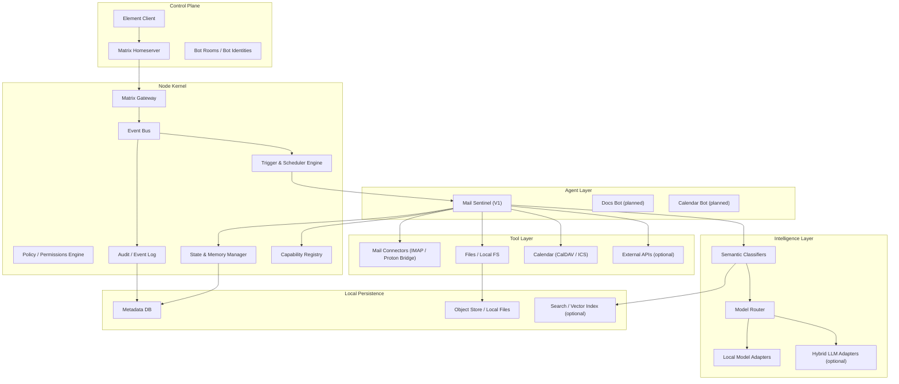
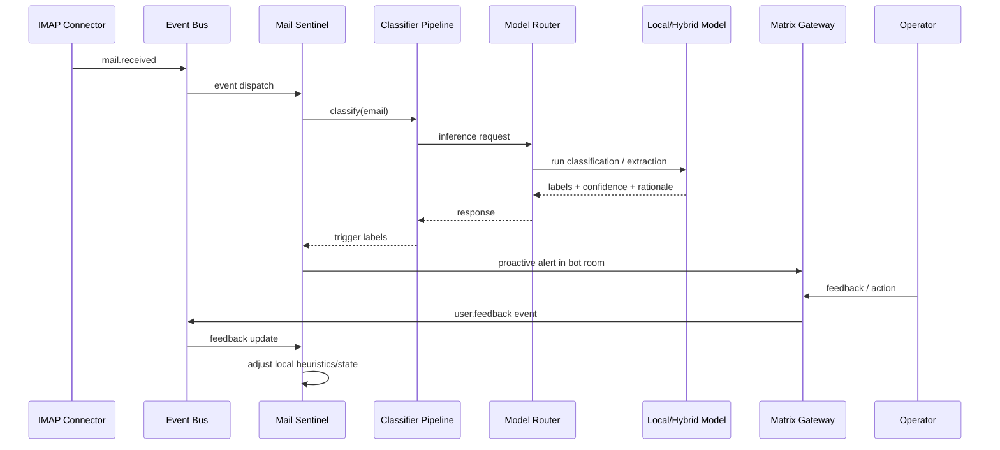

# Architecture Blueprint (Open Core)

## Purpose

Define the open-core architecture for a self-hosted, local-first, modular multi-agent runtime with Matrix as the primary control plane.

## Scope

This document covers:

- Core runtime architecture
- Module boundaries
- Data/control flows
- Extension points
- V1 Mail Sentinel implementation shape

This document does not define:

- UI pixel design
- Commercial packaging details (covered in `sovereign-ai-node-pro`)
- Final implementation language choices

## Architectural Identity

Sovereign AI Node is:

- A self-hosted AI control plane
- A multi-agent runtime
- A local interpretation layer for personal or small-team operations

It is not:

- A monolithic assistant
- A SaaS orchestration UI
- A cloud AI wrapper

## Design Goals

- Local-first by default
- Always-on event-driven processing
- Modular bots with isolated identities
- Explicit permissions and auditability
- No mandatory telemetry
- Cloud/hybrid capability as an optional adapter

## High-Level Component Model



## Core Subsystems

### 1. Control Plane Integration

Primary interface: Matrix.

Responsibilities:

- Bind bot identities to Matrix users/rooms
- Transform Matrix messages into internal commands/events
- Deliver alerts, summaries, and follow-up prompts back to rooms
- Keep chat as the default operator interface

Notes:

- Each bot should have its own identity and room(s)
- Shared infrastructure, separate operational identities

### 2. Node Kernel (Sovereign Runtime)

The Node Kernel owns the platform behavior that must not depend on a specific agent framework.

Responsibilities:

- Lifecycle management (start/stop/restart bots)
- Event bus and routing
- Trigger scheduling
- Capability discovery and registration
- Permissions/policy evaluation
- Persistent state and checkpoints
- Audit/event logging

Why this stays in open core:

- It is the sovereignty-critical control surface
- It enables replacement of agent frameworks without breaking the platform

### 3. Agent Layer

Bots are specialized modules with explicit responsibilities.

Bot contract (conceptual):

- `identity`: Matrix identity + bot metadata
- `capabilities`: tools and actions the bot may use
- `subscriptions`: events/triggers it listens to
- `state`: persistent bot-specific memory
- `handlers`: command and event processing routines
- `policies`: constraints and escalation behavior

Rules:

- No monolithic "super-agent" in core
- Bots are disable-able and auditable independently
- Shared infrastructure, not shared identity

### 4. Tool Layer

Tooling is provided via connectors and normalized data adapters.

Connector families:

- Mail: IMAP, SMTP (optional), Proton Bridge integration
- Files: local FS, mounted volumes
- Calendar: CalDAV/ICS
- APIs: explicit outbound allowlist only

Connector requirements:

- Typed capability declaration
- Local credential storage integration
- Rate limiting and timeouts
- Structured errors
- Audit hooks

### 5. Logic & Workflow Layer

This layer is event-driven and persistent.

Capabilities:

- Rule-based triggers
- Semantic classification pipelines
- Feedback loops (user correction -> classifier updates / weights)
- Long-running stateful workflows
- Escalation policies

Important distinction:

- Agent reasoning is not the same as orchestration reliability
- Durable orchestration primitives belong to the kernel/workflow layer

### 6. Sovereignty Layer (Cross-Cutting)

Defaults:

- Local model inference preferred
- No telemetry emitted by default
- Explicit outbound networking
- Self-hosted secrets and state

Optional:

- Hybrid model routing for cost/performance tradeoffs
- Bitcoin-aligned payment flow only for commercial distributions (Pro repo)

## V1 Architecture: Mail Sentinel

### Functional Goal

Continuously evaluate inbound mail and alert on high-signal events.

### V1 Trigger Classes

- `decision_required`
- `financial_relevance`
- `risk_escalation`

### V1 Event Flow



### V1 Storage Needs

- Message metadata index
- Classification results
- Alert history
- Feedback corrections
- Bot state/checkpoints

Implementation guidance:

- Start with a single local metadata DB (SQLite is acceptable for V1)
- Abstract repositories to allow later migration (Postgres, external stores)

## Extension Points (Stable Interfaces)

The following interfaces should be stable early, because Pro and future bots will depend on them:

- Agent runtime adapter
- Connector capability adapter
- Model provider adapter
- Event schema contracts
- Policy hook interface
- Audit/event sink interface

## Runtime Framework Strategy (OpenClaw + Adapters)

Recommended approach:

- Use OpenClaw as the initial agent execution engine (if it accelerates bot implementation)
- Keep scheduling, policy, state, and audit in the Node Kernel
- Wrap OpenClaw behind an `AgentRuntimeAdapter`

This avoids hard-coding the product architecture to a single framework.

## Deployment Topologies (Open Core)

### Single-Node Local (V1)

- Matrix homeserver
- Element client
- Sovereign AI Node runtime
- Local DB
- Optional local model service

### Hybrid-Optional Local

Same as above, plus:

- Outbound-only hybrid LLM adapter (explicitly enabled)

## Recommended Initial Package Layout

```text
packages/
  core-kernel/            # event bus, scheduler, policy, state, audit
  control-plane-matrix/   # matrix bridge + identity/room bindings
  agent-sdk/              # bot contracts, lifecycle hooks, capability APIs
  intelligence/           # classifiers, model routing, extraction pipelines
  model-providers/        # local and optional hybrid adapters
  tool-connectors/        # mail/files/calendar/api connectors
  storage/                # repositories, schema, migrations
  bot-mail-sentinel/      # v1 reference bot
  cli/                    # bootstrap, config, admin ops
```

## Non-Goals (Initial Open Core)

- Enterprise compliance workflows
- Multi-tenant control planes
- Cloud-hosted default mode
- Closed-source core orchestration logic

## Open Questions (To Resolve Before Implementation Starts)

- Primary implementation stack (TypeScript, Python, Rust, mixed)
- Event bus transport (in-process first vs Redis/NATS)
- Local indexing strategy (SQLite FTS, Tantivy, pgvector, etc.)
- Matrix homeserver recommendation (Synapse vs Conduit vs Dendrite)
- How OpenClaw integrates (embedded library vs sidecar runtime)

