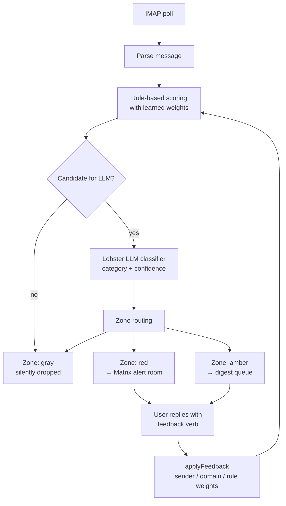

# Mail Sentinel — Storyboard Gap Analysis

## Purpose

This document compares the **Mail Sentinel Screenshot Storyboard** (received
from the product/marketing side) against the **actual behaviour of Mail
Sentinel 2.0 on `main`** as of 2026-04-11. The goal is to tell the storyboard
author which visuals can be captured today against the running bot, which need
alternative framing, and which describe features that do not exist yet.

Everything below is grounded in code currently on `main` of `sovereign-ai-bots`
at commit `7d4db69` (`bots/mail-sentinel/`). Line references are to that
checkout. No findings are taken from feature branches or stale worktrees.

## Framing

Mail Sentinel 2.0 is closer to the storyboard than a first read suggests. The
pipeline the storyboard proposes (heuristic prefilter → LLM second pass →
policy layer → zone routing → Matrix delivery → feedback-driven local
learning) is **the pipeline that exists today**. The zones are real
(`gray` / `amber` / `red`), the three categories are real, the
digest-vs-alert split is real, and feedback does update local policy.

The gaps are smaller and more cosmetic than structural:

- the alert and digest messages are in **German**
- they are **plain text**, not HTML
- feedback is given by **replying in the room with a phrase**, not by clicking
  buttons or reactions
- the storyboard invents one screenshot (a conversational "What matters
  today?" query) that has no equivalent in code
- a few field labels in the storyboard don't match what the bot emits

The rest of this document lists every mismatch and a concrete alternative for
each one, so the storyboard can be revised into something we can shoot
truthfully.

## Reference: what Mail Sentinel actually emits today

These two message shapes are the source of truth. Any screenshot we capture
will show one of them.

### Alert message (red zone) — `buildRedAlertMessage`

From `bots/mail-sentinel/src/alerts/format.ts:33`:

```
Mail Sentinel Alert [alert-1]
Zone: RED
Kategorie: Financial Relevance
Betreff: Invoice $500
Absender: Alice <alice@example.com>
Warum wichtig: invoice due today
Confidence: hoch (85%)
Feedback: 'War wichtig', 'Nicht wichtig', 'Spater erinnern', 'Immer so behandeln' oder 'Weniger davon'.
Mail-ID: <abc@ex>
```

Fields, in order: title + alert ID, **Zone** (`RED` / `AMBER` / `GRAY`),
**Kategorie** (one of three category labels), **Betreff** (subject),
**Absender** (from), **Warum wichtig** (why it matters — this is the real "why
this matters" field), **Confidence** as a bucketed label with percentage
(`niedrig (0–39%)` / `mittel (40–74%)` / `hoch (75–100%)` /
`unbekannt`), a **Feedback** line listing the five reply phrases,
and optionally **Mail-ID** if known. Reminders use the same template with the
title `Mail Sentinel Reminder`.

### Digest message — `buildDigestMessage`

From `bots/mail-sentinel/src/alerts/format.ts:51`:

```
Mail Sentinel Digest [digest-uuid]
Zeitraum: letzte 12h
Amber-Signale: 3

1. Invoice #4831 from hosting provider
   Absender: billing@hoster.tld
   Kategorie: Financial Relevance
   Confidence: mittel (62%)
   Warum: sender matches billing profile; amount above normal
2. …
3. …

Erstellt: 2026-04-11T08:00:00Z
```

One digest message per cycle, covering the current amber backlog with top-10
entries. Default interval `DEFAULT_DIGEST_INTERVAL = "12h"`. No explicit
"suppressed N low-signal emails" count — the gray items are silently filtered
and never recorded in the digest body.

### Startup hello

From `bots/mail-sentinel/sovereign-bot.json:9`:

> "Hello from Mail Sentinel 2.0. I prefilter inbox signals, review candidates
> semantically through Lobster, apply your policy, and route mail into red
> alerts, amber digests, or gray silence."

This is a static `helloMessage` declared in the bot manifest. OpenClaw decides
when (if ever) to post it; it is not a rich "online / watching X / digest
window Y / escalation path active" broadcast.

## Per-screenshot assessment

### Screenshot 1 — Hero Alert ("Decision Required")

| | |
|---|---|
| **Storyboard asks for** | Matrix room showing one clean Mail Sentinel alert with Category, Subject, "Why this matters", Confidence (Red), suggested action, and action buttons (Mark important / Not important / Digest next time). |
| **Mail Sentinel today** | All of this exists as text content **except** the buttons and the suggested-action line. `buildRedAlertMessage` already emits Zone, Kategorie, Betreff, Absender, **Warum wichtig**, Confidence, and a feedback hint — in German, plain text, no HTML. |
| **Recommended alternative** | Capture a real red-zone alert in the demo room. Keep the German labels *or* decide we want an English locale (see "Language" below). Replace the "Mark important / Not important / Digest next time" button strip with the real feedback line that already appears in the message: *Feedback: 'War wichtig', 'Nicht wichtig', 'Spater erinnern', 'Immer so behandeln' oder 'Weniger davon'*. Drop the "Suggested action: Review and reply today" line — it is not produced by the bot. |

This screenshot is achievable today. The hero shot will be a faithful capture
of the bot's real output, not a mockup.

### Screenshot 2 — Calm Digest / "What matters today?"

| | |
|---|---|
| **Storyboard asks for** | Either Option A: a daily digest showing "2 relevant signals today", grouped by category, plus "Suppressed: 14 low-signal emails". Or Option B: a conversational exchange where the user asks "What matters today?" and the bot replies in prose. |
| **Mail Sentinel today** | **Option A partially works.** `buildDigestMessage` produces a real digest with `Amber-Signale: N`, top-10 entries with Kategorie + Warum + Confidence. It has **no "suppressed N low-signal emails" count** — gray items are dropped silently and that number is not tracked in the digest body. It also has no per-category grouping; entries are a flat numbered list. **Option B does not exist.** There is no natural-language query interface, no "What matters today?" handler, and no auto-reply to free-text questions. Feedback is phrase-based and scoped to specific reply verbs, not open-ended chat. |
| **Recommended alternative** | Drop Option B entirely. Shoot Option A, accepting that the real message is a flat numbered list (not grouped by category) and does not include a "suppressed" count. If the author wants the suppressed count, that is a small feature request on the digest formatter: include `grayFiltered: N` in the scan telemetry and render it as "Stille: N ausgeblendet" in the digest footer. Can be specced separately. |

### Screenshot 3 — Matrix Room / Presence

| | |
|---|---|
| **Storyboard asks for** | Element sidebar with a handful of rooms including `#mail-sentinel:local`, and an "Mail Sentinel online" bot message listing watched sources, policy profile, digest window, escalation path. |
| **Mail Sentinel today** | The sidebar part is trivial — create three rooms in the demo homeserver, done. The bot message is **not** what the storyboard describes. The real hello message is a single static sentence declared in `sovereign-bot.json` ("Hello from Mail Sentinel 2.0. I prefilter inbox signals…"). There is no runtime broadcast describing watched sources, digest window, or escalation path. |
| **Recommended alternative** | Capture the real hello message in the demo room and frame the screenshot around it. If the author wants the richer "Watching configured mail sources via IMAP / Policy profile loaded / Digest window: 08:00 / 18:00 / Escalation path active" line, that's a small bot-side feature request — a `status` command or a boot broadcast that stringifies the runtime config into a short report. Straightforward to add; not in scope for this doc. |

### Screenshot 4 — Alert + Feedback Loop

| | |
|---|---|
| **Storyboard asks for** | Three-message flow: alert arrives → user clicks "Digest only" button → bot replies "Preference updated locally: similar billing messages from this sender will default to digest unless…". |
| **Mail Sentinel today** | Two of the three messages are real. The alert (message 1) exists. The policy adaptation behind the scenes (message 3's *effect*) exists — feedback updates `senderWeights`, `domainWeights`, and `ruleAdjustments` in local state (`bots/mail-sentinel/src/policy/actions.ts`). What is missing is: (a) the user action is a **typed reply** in the room ("Weniger davon" or "digest-only" via CLI), not a button click; (b) the bot does **not post a confirmation reply** explaining what just changed. The storyboard's third bubble does not exist. |
| **Recommended alternative** | Shoot the two real messages — alert and feedback reply — in sequence. For the third bubble, either (1) omit it and caption the screenshot "feedback adjusts local sender/domain/rule weights — next matching message is routed differently", or (2) spec a small `feedback` post-action: after `applyFeedback` writes to state, post a one-line Matrix reply summarising the policy delta (e.g. *"Weniger davon übernommen: billing@hoster.tld → weight −2, Schwelle angepasst"*). Again, a bot-side feature request — achievable in a small PR, not in scope here. |

Also: the storyboard's button labels ("Mark important / Not important / Digest
next time / Ignore future similar") do not match the real feedback verbs. The
seven real feedback actions, from `bots/mail-sentinel/src/types.ts:14`, are:

- `important` → *War wichtig*
- `not-important` → *Nicht wichtig*
- `less-often` → *Weniger davon*
- `remind-later` → *Spater erinnern*
- `always-like-this` → *Immer so behandeln*
- `reduce` (sender suppression)
- `digest-only`

### Screenshot 5 — Architecture Diagram

| | |
|---|---|
| **Storyboard asks for** | A flow diagram: IMAP → Intake → Heuristic Prefilter → LLM Second Pass → Policy Layer → Confidence Routing (Red/Amber/Gray) → User Feedback → Local scoring adjustment. |
| **Mail Sentinel today** | **This matches the real pipeline almost exactly.** The code path in `bots/mail-sentinel/src/commands/scan.ts` goes: IMAP poll → parse → rule-based scoring → `buildLlmCandidate` filter → `runtime.classifyCandidate` (Lobster LLM) → `determineZone` (red/amber/gray) → alert-to-Matrix or digest-queue or silent. Feedback goes through `policy/actions.ts` to update sender/domain/rule weights, which feed back into the next scan. |
| **Recommended alternative** | **Write this diagram as-is.** The only adjustment: the policy layer is a set of learned weights plus a static `default-rules.json`, not a "policy engine" box. The storyboard's diagram can be rendered directly as a Mermaid flowchart in the sovereign-ai-node README. |

Proposed Mermaid source:



This is the real V1 pipeline, not an aspirational one. It can be committed to
the sovereign-ai-node README in the same PR as the screenshot assets.

## Flat gap list — 10 claims

| # | Storyboard claim | Status | Closest real behaviour |
|---|---|---|---|
| 1 | Alert fields: Category, Subject, "Why this matters", Confidence, Suggested action | ✓ mostly | Real fields: Zone, Kategorie, Betreff, Absender, **Warum wichtig**, Confidence (bucket + %). No "suggested action" line. German labels, plain text. |
| 2 | Daily digest with "N relevant today" and "Suppressed N low-signal" | ~ partial | `buildDigestMessage` produces a real digest with `Amber-Signale: N` and top-10 entries. No "suppressed" count field. Flat numbered list, not category-grouped. |
| 3 | Conversational "What matters today?" chat query | ✗ missing | No NLU handler. Feedback is phrase-matched only. Closest: run `list-alerts --view today` via the CLI, but that is operator-side, not user-side. |
| 4 | Categories: Decision Required / Financial Relevance / Risk / Escalation | ✓ exact | `CATEGORY_LABELS` in `bots/mail-sentinel/src/constants.ts:24` matches the storyboard 1:1. |
| 5 | Confidence zones Red / Amber / Gray with tiered routing | ✓ real (as Zones) | `ZONE_ORDER = { gray: 0, amber: 1, red: 2 }`. Red → Matrix alert, amber → digest, gray → silence. The storyboard conflates "Zone" and "Confidence" — the bot treats them as **separate fields** (Zone = routing tier, Confidence = numeric LLM certainty bucket). |
| 6 | Feedback actions: Mark important / Not important / Digest next time / Ignore future similar | ~ wrong labels | Real actions (7 total): `important`, `not-important`, `less-often`, `remind-later`, `always-like-this`, `reduce`, `digest-only`. Invoked by replying with German phrases — no buttons. |
| 7 | Feedback adapts local policy (no model retraining) | ✓ exact | `policy/actions.ts` updates `senderWeights`, `domainWeights`, `ruleAdjustments` in local state. Deterministic, queryable, persisted. |
| 8 | Startup presence broadcast listing watched sources, policy, digest window, escalation path | ✗ missing | Static `helloMessage` in `sovereign-bot.json` is one sentence. No runtime status broadcast. |
| 9 | Pipeline: IMAP → Intake → Heuristic Prefilter → LLM Second Pass → Policy → Zones | ✓ exact | Matches the real `scan.ts` pipeline. Lobster is the real LLM classifier. |
| 10 | "Suppressed 14 low-signal emails" metric | ~ partial | Scan telemetry tracks `newMessages`, `alertsSent`, `remindersSent`. Gray-drop count is not surfaced in the digest body. One-line formatter change to expose it. |

## Concrete rewording suggestions

These are drop-in replacements the storyboard author can apply directly:

1. **"Confidence: Red"** → **"Zone: RED, Confidence: hoch (85%)"**. The bot
   treats zone and confidence as separate fields. Red = routing tier, 85% =
   LLM certainty.
2. **"Suggested action: Review and reply today"** → delete. Not produced by
   the bot. If the author wants a call-to-action line, it can be added to
   `buildRedAlertMessage`, but that is a feature request.
3. **Action buttons "Mark important / Not important / Digest next time /
   Ignore future similar"** → **Feedback hint line "Reply with: *War wichtig*,
   *Nicht wichtig*, *Weniger davon*, *Spater erinnern*, *Immer so behandeln*"**.
   This is what the bot actually posts, word for word.
4. **Option B "What matters today?" conversational query** → delete the
   option. Keep only Option A (daily digest). The conversational interface
   does not exist.
5. **"Suppressed: 14 low-signal emails"** → either delete the line, or
   flag it as a small feature request on the digest formatter (add a
   `grayFiltered` counter to scan telemetry and render it as
   "Stille: N ausgeblendet" in the digest footer).
6. **Startup message "Mail Sentinel online / Watching configured mail
   sources / Policy profile loaded / Digest window: 08:00 / 18:00 /
   Escalation path active"** → replace with the real one-line hello, or
   spec a `status` command that stringifies runtime config into a report.
7. **"Digest next time" feedback action** → **"Digest only"** (the real
   action name is `digest-only`). Or use **"Weniger davon"** if keeping the
   German reply phrasing.
8. **Architecture diagram heading "LLM Second Pass (candidate mails only)"**
   → keep as-is. This is exactly what `buildLlmCandidate` + `classifyCandidate`
   do. The Lobster model is the real LLM.

## Language decision (open question for the author)

The biggest single decision: **do we shoot the screenshots in German or in
English?**

- **Shoot in German (as-is).** Most faithful. Captures the real bot output
  with no edits. Labels: Zone, Kategorie, Betreff, Absender, Warum wichtig,
  Confidence, Feedback. Reply verbs are German. The storyboard can be
  translated around the screenshots.
- **Shoot in English.** Requires an i18n pass on `format.ts` and
  `time.ts::formatConfidenceLabel` — not huge, but a real code change. Labels
  become: Zone, Category, Subject, From, Why it matters, Confidence. Reply
  verbs would have to be bilingual or English-only.
- **Hybrid: English UI strings, German reply phrases.** Not recommended —
  would make the Feedback hint line inconsistent with everything else.

**Recommendation:** shoot in German for the hero and digest screenshots, and
translate the captions around them in the storyboard. This matches what a
real operator's Matrix room looks like today and avoids shipping a cosmetic
i18n change just for marketing assets. If the author insists on English, it's
a separate small PR against the bot.

## Recommendations for the revised screenshot set

If the author accepts the gaps above, here is the screenshot set we can
credibly capture today against the real bot on the `cathouse` homeserver as
user `ndee`:

1. **Hero alert** — real `buildRedAlertMessage` output in a clean demo room.
   One red alert. German labels. Caption translated.
2. **Digest** — real `buildDigestMessage` output. Flat numbered list, 2–3
   amber entries. Drop the "suppressed" line or mark it as a follow-up feature.
3. **Matrix room / presence** — clean Element sidebar with three rooms plus
   the static `helloMessage` from the bot manifest. Drop the
   "watching / digest window / escalation path" line or spec it as a
   follow-up.
4. **Feedback in action** — two real messages: alert posted by bot, user
   reply with "Weniger davon". Caption explains that local sender/domain
   weights are updated as a result. Drop the third "confirmation bubble" or
   spec a small feedback-confirmation reply as a follow-up.
5. **Architecture diagram** — Mermaid flowchart in the sovereign-ai-node
   README, using the real pipeline shown above. No binary asset needed.

Everything gated on the author's response:

- **Yes, go shoot** → we agree on the decisions above and start captures.
- **Need feature tweaks first** → file small, scoped bot-side PRs for:
  suppressed-count metric, runtime-status broadcast, feedback confirmation
  reply, optional English i18n. Each one is a single-file change on
  `bots/mail-sentinel/src/alerts/format.ts` or similar.
- **Keep the richer storyboard, shoot mockups** → not recommended. It would
  misrepresent the product.
